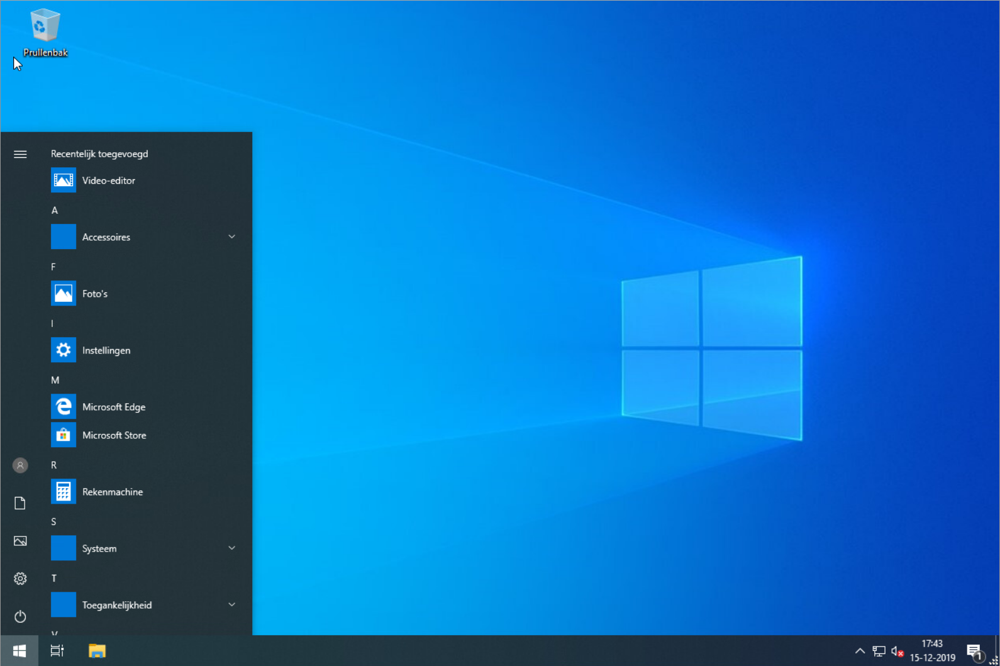

# SetupCompleted
A small script to optimize Windows 10 after installation

## Features
1. Remove all Windows 10 apps(excluding Calculator, Store, Photo's)
   
2. Set This PC as default Launch folder for Windows Explorer
   
3. Remove the SearchBox from the Taskbar
   
4. Unpin all default tiles from the Startmenu
   
5. Unpin all apps from the taskbar (except Windows Explorer)
   
6. Remove all shortcuts from the desktop
   
7. Uninstalls Microsoft OneDrive

## How to Use
1. Open script.psi in a text editor and remove all lines that you don't want to execute. 
2. Run the setupcomplete.cmd file. (It will prompt for admin rights)

Warning: this script will delete all Windows 10 apps, excluding calculator, store and photo's! 
Also all shortcuts, and pinned apps will be removed!

